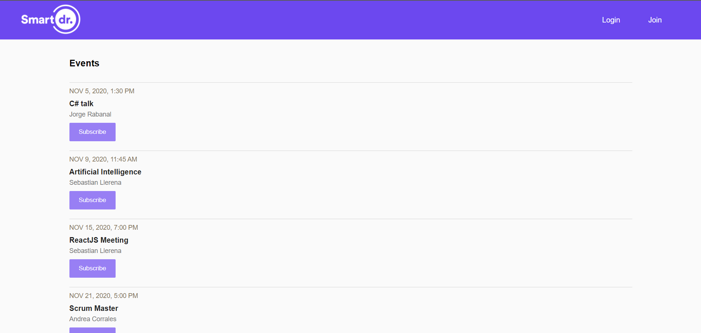

# Smart Doctor
Webpage to subscribe and create events

Features:

* User can subscribe and unsubscribe to events
* User can create events
* You can register, or you can log in with the default user: 
    * email: a@a.com
    * password: 123

[See app in production](https://smartdoctor-alg.netlify.app)

## Scripts

* `npm install` to install dependencies
* `npm run start` to development environment
* `npm run build` to production

## License

ISC
